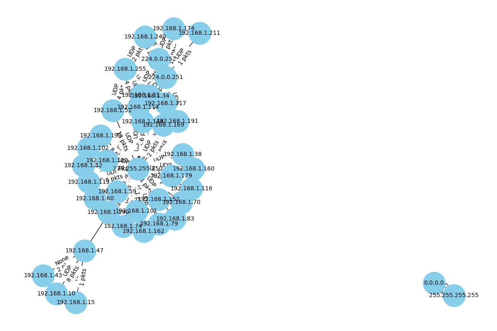
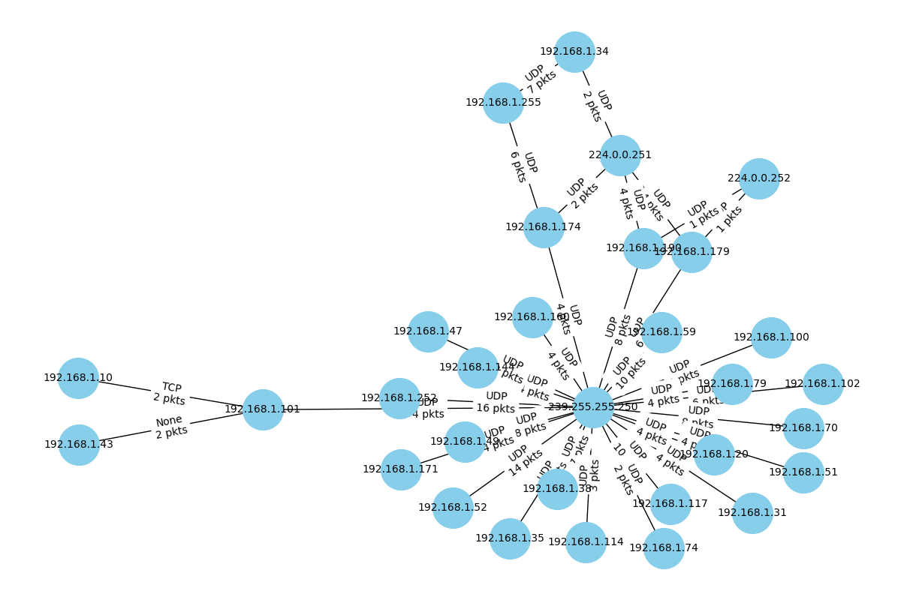

# Network Conversations Visualizer  

This project parses PCAP files to extract network device 
information and visualize network conversations done in the given pcap file. 
It provides a tool to generate network diagrams and analyze the traffic between devices.


## Installation

1. Clone the repository:
```
   git clone https://github.com/MikaHurvits/ConversationsVisualizer.git
   cd ConversationsVisualizer
  ```

2. Install dependencies:
```
pip install -r requirements.txt
```

## Usage:

Place your .pcap file in the pcap_files/ folder and run the script:

```
python main.py
```
This will parse the PCAP file and generate a network diagram saved as network_diagram.png.

### Tests
Run tests using pytest:
```
pytest test.py
```

### Results Screenshots




